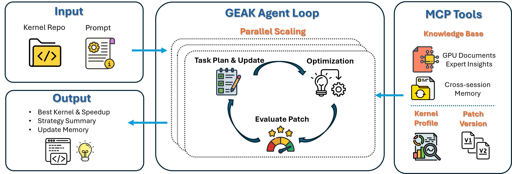

# GEAK

GEAK is an agent-driven framework for end-to-end GPU kernel optimization in real codebases, producing reviewable patches backed by profiling, testing, and LLM-guided iteration. Supports **HIP**, **Triton**, and **FlyDSL** kernels.

---

## Core Capabilities

- End-to-end optimization
  - Automatically discovers or generates tests and harness scripts
  - Runs a closed loop: profiling → optimization → validation
  - Produces reproducible patches and benchmarks

- Repository-level workflows
  - Works beyond single kernels — supports full-repository optimization (L3)
  - Maintains a consistent test, baseline, and evaluation pipeline

- Parallel exploration
  - Multi-agent search across isolated Git workspaces
  - Improves robustness by exploring multiple optimization strategies

---

## Architecture




---

## Getting Started

### Installation

```bash
git clone https://github.com/AMD-AGI/GEAK
cd GEAK
# Docker-based
AMD_LLM_API_KEY=<YOUR_KEY> bash scripts/run-docker.sh

# Local install (recommended)
make install              # core + MCP tools (same as Docker)
make install-full         # + dev tools + swe-rex
make install-dev          # install-full, editable (for developers)

# (or) pip-only install without registering MCP tools as packages
pip install -e .          # core package, including MCP runtime dependencies
pip install -e '.[full]'  # core + dev + langchain + swe-rex

# (optional) RAG index build: if enable RAG, build index after make install
make index

# Set model name and key. In the case of docker-based setup, export the API key before
# running scripts/run-docker.sh.

# Option 1: set a LiteLLM model + provider API key
export MSWEA_MODEL_NAME="openai/gpt-5"
export OPENAI_API_KEY="YOUR_KEY"

# Anthropic example
export MSWEA_MODEL_NAME="anthropic/claude-opus-4-6"
export ANTHROPIC_API_KEY="YOUR_KEY"

# Option 2: If you use AMD LLM Gateway (model_class: amd_llm)
export AMD_LLM_API_KEY="YOUR_KEY"
```

### Usage

#### Basic GPU kernel optimization

```bash
# Typical kernel optimization using natural language input
geak -t "Optimize the kernel from /path/to/aiter, specifically aiter/ops/triton/topk.py. Use the harness at /path/to/test_topk_harness.py. Use four GPUs with IDs 0-3 simultaneously."

# Typical kernel optimization
geak --repo /path/to/kernel/repo \
  --task "Optimize the block_reduce kernel"
```

#### Parallel optimization

- GEAK preprocesses the target once, then runs a shared optimization loop
- Each worker runs in an isolated git workspace
- Patches and test results are saved separately per round
- After each round, GEAK verifies the best candidate and carries the best patch forward

```bash
geak --repo /path/to/kernel/repo \
  --task "Optimize the block_reduce kernel. Kernel path: xxx. Metric: bandwidth in GB/s (higher is better)." \
  --num-parallel 4 \
  --gpu-ids 0,1,2,3
```

**Notes:**

- `--repo`: required; the target repository path
- `--kernel-url`: optional; path to the target kernel file (local path or URL)
- `--num-parallel`: optional; number of optimization agents
- `--gpu-ids`: optional; comma-separated GPU IDs for agents
- By default, after optimization completes GEAK **applies the best patch** to the repo (committed on the current branch) and **cleans up** intermediate artifacts, keeping only `final_report.json`, the winning `.diff`, `geak_agent.log`, and `COMMANDMENT.md`.
- `--debug`: disables both post-run patch apply and artifact cleanup, preserving the full run directory for inspection
- `--mode quick` and `--mode full` are **absolute wall-clock caps**
  of 60 min and 120 min respectively. The hard-kill watchdog `os._exit(124)`s at
  `started_at + total_s` exactly — this anchor enforces the cap. Internally, the
  cooperative budget reserves finalize and kill-buffer headroom; this is invisible to
  the user and is not load-bearing for the cap promise.
- `--total-budget-s`: optional; override the mode's total wall-clock budget in seconds (e.g. `--total-budget-s 18000` for a 300-min cap)

### Runnable examples

These are **examples** you can test in `examples/`. Replace paths, GPU IDs, and the metric wording as needed.

**Example: HIP kernel `knn`**

```bash
# Repo root containing the kernel file
REPO="/path/to/GEAK/examples/knn"

geak --repo "$REPO" \
  --test-command "python scripts/task_runner.py compile && python scripts/task_runner.py correctness && python scripts/task_runner.py performance" \
  --task "Optimize the knn kernel. Metric: latency (lower is better)." 
```

**Example: Triton kernel `mla_decode`**

```bash
REPO="/path/to/GEAK/examples/mla_decode"

geak --repo "$REPO" \
  --test-command "python3 -c \"import ast; ast.parse(open('kernel.py').read())\" && python3 'test_kernel_harness.py' --correctness && python3 'test_kernel_harness.py' --full-benchmark" \
  --task "Optimize the MLA decode Triton kernel." 
```

**Example: FlyDSL kernel `preshuffle_gemm`**

```bash
# FlyDSL repo root (requires `pip install flydsl` in the environment)
REPO="/path/to/FlyDSL"

geak --repo "$REPO" \
  --task "Optimize the preshuffle GEMM kernel."
```

**Example: GEMM tuning for SGLang + AITer**

```bash
# Requires sglang + aiter in the environment
cd examples/sglang_aiter_gemm_tuning

geak-gemm-tuning -t "Optimize the E2E performance of the workload via GEMM tuning. The benchmark script is run_sglang_test.sh"
```

For more options and examples, see **[Quick start](docs/quick_start.md)**.


### Configuration

#### Loading Configurations

`geak` loads configuration in layers:

1. strategy template: `src/minisweagent/config/mini_kernel_strategy_list.yaml`
2. run config: `src/minisweagent/config/geak.yaml` (model, env, tools, budgets), or the file passed with `--config`
3. CLI overrides, such as `--mode`, `--gpu-ids`, and `--num-parallel`

For more options and examples, see [Configuration](docs/configuration.md).


### Output & Artifacts

GEAK saves patches and test logs so the optimization progress and results remain transparent.

- **Default output base**: `optimization_logs/`
- **Auto-generated run directory**: `optimization_logs/<kernel_name>_<YYYYmmdd_HHMMSS>/`

Typical structure (parallel run):

```bash
optimization_logs/<kernel>_<timestamp>/
├── CODEBASE_CONTEXT.md
├── COMMANDMENT.md
├── baseline_metrics.json
├── profile.json
├── tasks/round_1/
│   ├── 05_-canonical.md
│   └── 10_planned-strategy.md
├── results/round_1/<worker>/
│   ├── patch_0.patch
│   ├── patch_0_test.txt
│   └── task_0.log
├── round_1_evaluation.json
├── final_report.json
└── geak_agent.log
```

---

## Features

---

### Preprocess and Harness Setup

If `--test-command` is not provided, GEAK will:

- Discover existing tests, or
- Create and verify a harness for the target kernel

The resulting `COMMANDMENT.md` is the single source of truth for the optimization run, ensuring consistent correctness and benchmark evaluation.

---

### Patch-Driven Optimization

- Patch-based iteration — every step produces a reproducible diff
- Metric-guided — optimize for task-defined or custom metrics
- Strategy-aware — tracks and prioritizes effective optimization directions

---

### Parallel Scaling

Run multiple agents with:

```bash
--num-parallel N
```

- Isolated git worktrees per agent
- Optional GPU pinning via `--gpu-ids`
- Improves exploration while keeping evaluation consistent across workers

---

### Best Patch Selection

Automatically selects the best result across rounds:

- Verifies candidate patches with the run's benchmark contract
- Writes `round_N_evaluation.json` after each round
- Outputs the best verified result in `final_report.json`

---

### Skills & Subagents

GEAK uses **skills** (domain knowledge bases) and **subagents** (delegated specialist agents) to handle different kernel types and optimization tasks.

**Skills** (`skills/`):

| Skill | When loaded |
|-------|-------------|
| `triton` | Harness generation for `@triton.jit` kernels |
| `hip` | Harness generation for HIP / CUDA / CK / HSACO kernels |
| `flydsl` | Writing, optimizing, and debugging `@flyc.kernel` FlyDSL kernels |
| `pytorch2flydsl-translation` | Translating PyTorch GPU kernels to FlyDSL |
| `fp8-gemm-tuning-sglang-aiter` | FP8 GEMM tuning for SGLang + AITer workloads |

**Subagents** (`subagents/`):

| Subagent | Purpose |
|----------|---------|
| `general-kernel-optimization` | Core optimizer — systematic strategy exploration for HIP, Triton, CK, FlyDSL |
| `harness-generator` | Creates immutable test harnesses with `--correctness`, `--profile`, `--benchmark` modes |
| `codebase-explore` | Discovers kernel files, dependencies, tests, and build systems |
| `gemm-tuning` | GEMM selection and configuration tuning (flags, env, kernel tables) |
| `speedup-verify` | Parses benchmark logs and computes speedup |
| `reverse-knowledge` | Extracts optimization insights from git history |
| `pytorch-to-flydsl` | PyTorch → FlyDSL kernel translation |

---

### Tooling Layer

- Kernel Profile — bottleneck analysis (bandwidth, occupancy, etc.)
- RAG — GPU knowledge retrieval (AMD / NVIDIA)
  - See **[RAG MCP Server](mcp_tools/rag-mcp/README.md)** for configuration and usage details.
- In-session strategy tracking — full history, reproducibility, rollback
- Cross-session memory — reuse past optimization insights

  | Flag | Default | What it does |
  |------|---------|--------------|
  | `GEAK_MEMORY_DISABLE=1` | off | Turn off all memory (within-session + cross-session) |
  | `GEAK_USE_KNOWLEDGE_BASE=0` | on | Turn off reading past insights from the knowledge base |
  | `GEAK_SAVE_TO_KNOWLEDGE_BASE=1` | off | Turn on saving run insights to the knowledge base after each run |
  | `GEAK_MEMORY_MIN_SPEEDUP=1.10` | 1.10 | Minimum speedup required to save an experience |

  By default, the knowledge base is **read** (agents see past insights) but **not written** (run results are not saved back). Set `GEAK_SAVE_TO_KNOWLEDGE_BASE=1` to start building the knowledge base from your runs.

## Contributing

We appreciate all contributions. If you are planning to contribute bug fixes, feel free to open a pull request without opening an issue first.

If you plan to contribute **new features, utility functions, or changes to the core**, please **open an issue first** and discuss the design with us. A pull request sent without that discussion may be **closed or not merged** if it diverges from the direction we are taking the project.

For branching, pull requests, code standards, CI expectations, releases, and licensing details, see **[Contribution guidelines](docs/developer/contribution_guidelines.md)**.

## Acknowledgments

GEAK extends [mini-SWE-agent](https://github.com/SWE-agent/mini-SWE-agent) — the agent loop, environment tooling, and SWE-style workflows. For upstream behavior and APIs, see the [mini-SWE-agent documentation](https://mini-swe-agent.com/latest/).

We also thank:

- [LiteLLM](https://github.com/BerriAI/litellm) — unified LLM routing used by model backends
- [Typer](https://github.com/tiangolo/typer) & [Rich](https://github.com/Textualize/rich) — CLI and terminal UX
- [Model Context Protocol (MCP)](https://modelcontextprotocol.io/) ecosystem (e.g., `mcp`, FastMCP) — tool servers for profiling, metrics, and discovery
- [LangChain](https://github.com/langchain-ai/langchain) (optional `[langchain]` extra) — hybrid retrieval for the GPU knowledge path
- AMD Research [IntelliKit](https://github.com/AMDResearch/intellikit) (`metrix`) — GPU profiling metrics integration

Dependencies and versions are listed in `pyproject.toml`; all third-party software remains under their respective licenses.