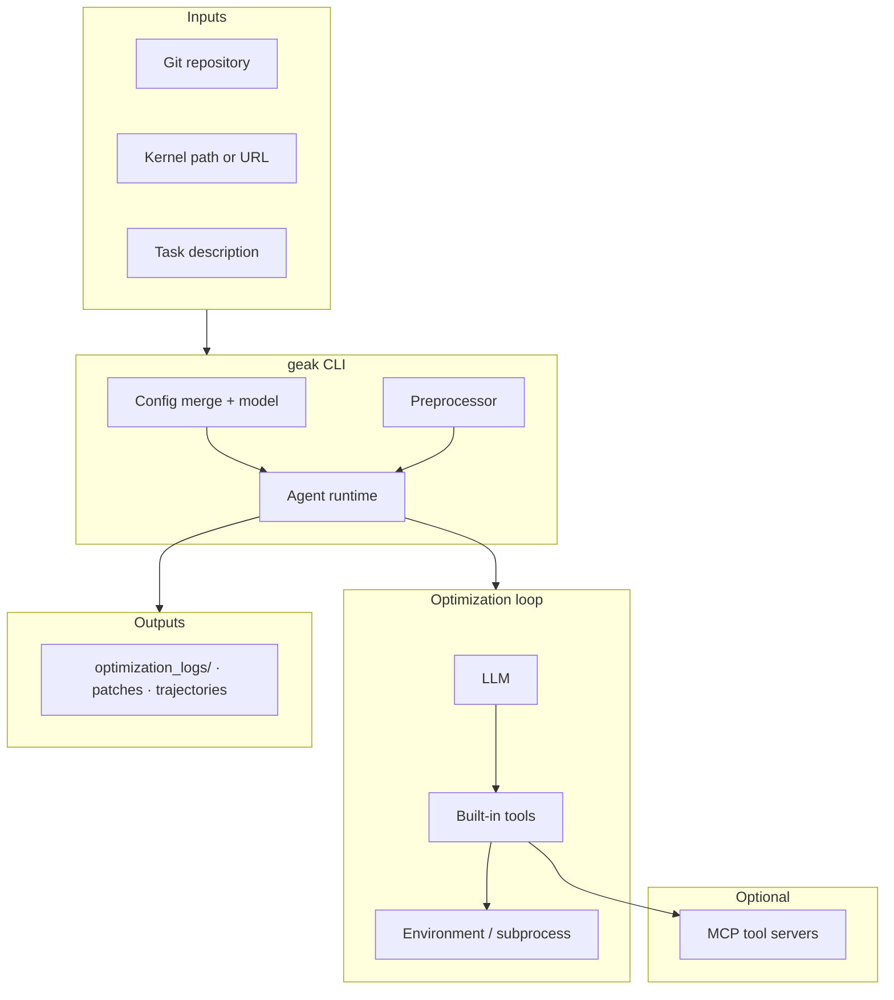

# GEAK-v3

**For teams shipping GPU kernels in real repositories** — GEAK is an agent-driven framework that turns profiling, tests, and LLM reasoning into **reviewable patches**, from one file to repo-wide runs.

- **Stack-aware** — **HIP** and **Triton** are the primary optimization targets today; support for additional languages and stacks (including ASM, Gluon, and others) is on the roadmap.
- **Closed-loop / end-to-end** — **`geak`** can carry a run from start to finish: generate or discover **test/harness scripts** when needed, **run profiling**, iterate with the LLM, **save every patch** on disk, and **pick the best result** against your metrics—artifacts land under `optimization_logs/` for reproducibility.  
- **Scales with hardware** — Multi-agent parallel search with isolated git workspaces and best-patch selection when you explore competing strategies.

**Documentation:** Markdown under [`docs/`](docs/) — start with **[Quick start](docs/quick_start.md)** if you want to run `geak` immediately.

## Architecture

Simplified data flow for a typical **`geak`** run (homogeneous path; heterogeneous / RAG entrypoints omit details):



Parallel runs add multiple isolated workspaces and a **best-patch** selection step on top of the same building blocks.

## Table of Contents

- [Architecture](#architecture)
- [Getting Started](#getting-started)
  - [Installation](#installation)
  - [Usage](#usage)
  - [Configuration](#configuration)
  - [Output & Artifacts](#output--artifacts)
- [Features](#features)
  - [Unit Test Discovery](#unit-test-discovery)
  - [System Tools (Built-in)](#system-tools-built-in)
  - [Best Patch Selection](#best-patch-selection)
  - [Knowledge Base Retrieval](#knowledge-base-retrieval)
- [Evolution: From Foundation to Platform](#evolution-from-foundation-to-platform)
- [Summary](#summary)
- [Acknowledgments](#acknowledgments)

---

## Getting Started

### Installation

```bash
git clone https://github.com/AMD-AGI/GEAK
cd GEAK
pip install -e .

# Set model name and key

# Option 1: set a LiteLLM model + provider API key
export MSWEA_MODEL_NAME="openai/gpt-5"
export OPENAI_API_KEY="YOUR_KEY"

# Anthropic example
export MSWEA_MODEL_NAME="anthropic/claude-sonnet-4-5-20250929"
export ANTHROPIC_API_KEY="YOUR_KEY"

# Option 2: If you use AMD LLM Gateway (model_class: amd_llm)
export AMD_LLM_API_KEY="YOUR_KEY"
```

### Usage

#### Basic (single-agent) GPU kernel optimization

```bash
# Interactive REPL
geak

# Typical kernel optimization (single agent)
geak --kernel-path /path/to/kernel/file \
  --repo /path/to/kernel/repo \
  --task "Optimize the block_reduce kernel"


#### Parallel optimization (multiple agents)

- Each agent works in an isolated git workspace
- Patches and test results are saved separately
- After all runs finish, GEAK automatically selects the best patch based on the specified metric

```bash
geak --num-parallel 4 \
  --repo /path/to/kernel/repo \
  --task "Optimize block_reduce kernel. Kernel path is xxx" \
  --gpu-ids 0,1,2,3 \
  --metric "Extract Bandwidth in GB/s (higher is better)" \
```

**Notes:**

- `--num-parallel`: number of optimization agents
- `--repo`: required when `--num-parallel > 1` (each agent uses an isolated git worktree)
- `--gpu-ids`: comma-separated GPU IDs for agents
- `--metric`: natural-language instruction for extracting/comparing metrics from test logs
- `--yolo`: run end-to-end without interactive confirmation

For more options and examples, see **[Quick start](docs/quick_start.md)**.


### Configuration

#### Loading Configurations
`geak` loads configs in layers:

1. base config: `geak.yaml`
2. template: `mini_kernel_strategy_list.yaml` (default)
3. user override: `--config xxx.yaml`
4. cli override: cli args (**final override**)

For more options and examples, see **[Configuration](docs/configuration.md)**


### Output & Artifacts

GEAK saves patches + test logs so results are reproducible.

- **Default output base**: `optimization_logs/`
- **Auto-generated run directory**: `optimization_logs/<kernel_name>_<YYYYmmdd_HHMMSS>/`
- **Parallel runs**: subfolders `parallel_0/`, `parallel_1/`, ...

Typical structure (parallel run):

```bash
optimization_logs/<kernel>_<timestamp>/
├── parallel_0/
│   ├── patch_0.patch
│   ├── patch_0_test.txt
│   └── agent_0.log
├── parallel_1/
│   └── ...
├── best_results.json
└── select_agent.log
```

---

## Features


---

## Evolution: From Foundation to Platform

### GEAK v1 — Foundation (Triton)

GEAK v1 established the foundation with Triton-based kernel generation.

- Reflexion-based kernel generation
- Instruction → Triton kernels
- TritonBench / ROCmBench improvements

**Outcome:** AI viability proven — LLM-based agents can generate and improve GPU kernels.

### GEAK v2 — Expansion (Agent Family)

GEAK v2 expanded into a multi-agent system for HIP kernel optimization.

- **OptimAgent:** profiling-driven optimization with multi-offspring exploration
- **OpenEvolve:** genetic optimization for kernel evolution
- support HIP → HIP kernel optimization

**Outcome:** Scalable multi-agent system

### GEAK v3 — Platform (L1 → L3)

GEAK v3 evolves into a unified platform supporting the full optimization stack.

- Support **L3** kernel optimization (repository-level, full lifecycle)
- Reduce human intervention via closed-loop automation
- Unified kernel optimization (test discovery, baselines, profiling, strategy execution, validation)

**Outcome:** Anyone can optimize kernels — from single-kernel tuning to autonomous repo-level optimization.

---

## Summary

GEAK v3 enables reproducible, measurable, and scalable GPU kernel optimization at repository scale. It integrates:

- **Profiling** + **Strategy Management** + **Parallel Exploration** for autonomous optimization
- **Knowledge Retrieval** with AMD/NVIDIA knowledge bases for informed decision-making

Contributions, experiments, and feedback are welcome.

## Acknowledgments

GEAK extends **[mini-SWE-agent](https://github.com/SWE-agent/mini-SWE-agent)** — agent loop, environment tooling, and SWE-style workflows — for upstream behavior and APIs, see the **[mini-SWE-agent documentation](https://mini-swe-agent.com/latest/)**.

We also thank:

- **[LiteLLM](https://github.com/BerriAI/litellm)** — unified LLM routing used by model backends  
- **[Typer](https://github.com/tiangolo/typer)** & **[Rich](https://github.com/Textualize/rich)** — CLI and terminal UX  
- **[Model Context Protocol (MCP)](https://modelcontextprotocol.io/)** ecosystem (e.g. `mcp`, **FastMCP**) — tool servers for profiling, metrics, and discovery  
- **[LangChain](https://github.com/langchain-ai/langchain)** (optional `[langchain]` extra) — hybrid retrieval for the GPU knowledge path  
- **AMD Research [IntelliKit](https://github.com/AMDResearch/intellikit)** (`metrix`) — GPU profiling metrics integration  

Dependencies and versions are listed in `pyproject.toml`; all third-party software remains under their respective licenses.
